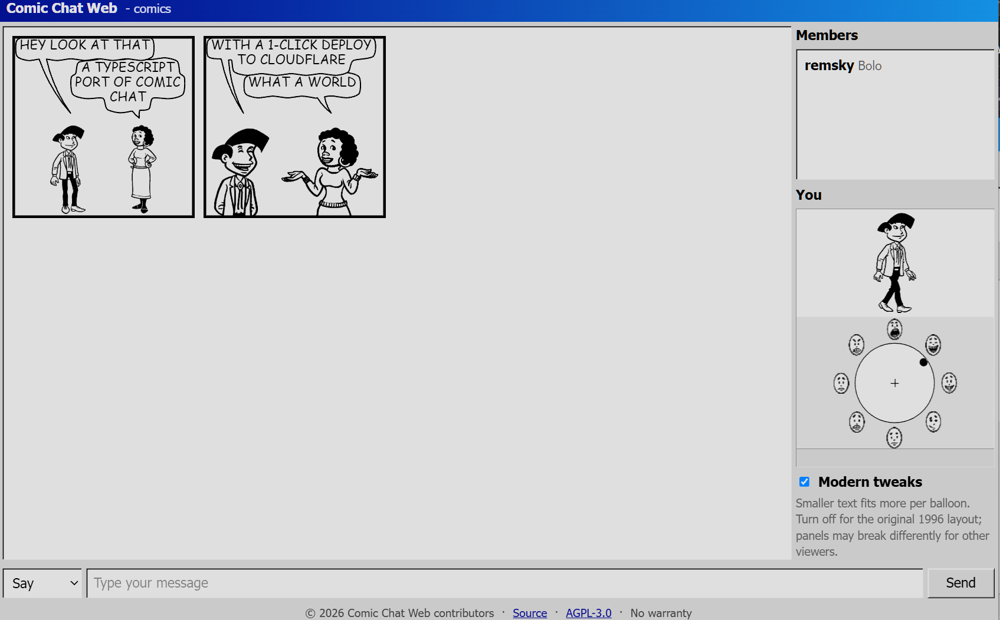
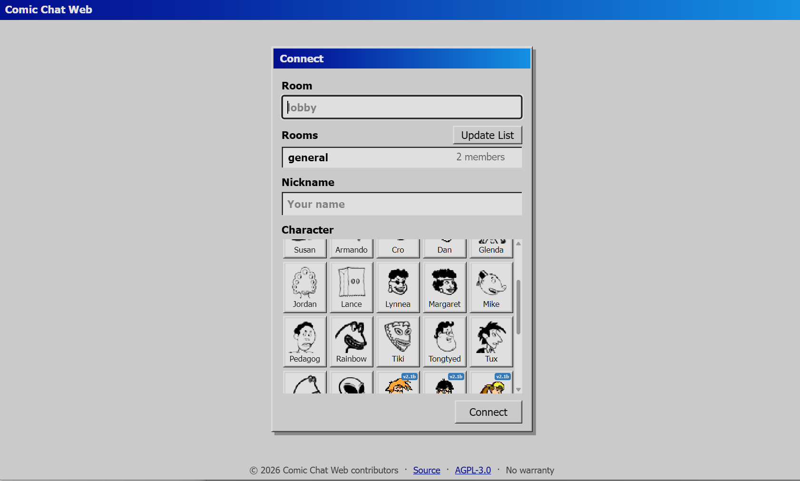

<h1>
  
  Comic Chat Web
</h1>

**Modern TypeScript port of the 1996 Microsoft Comic Chat IRC client w/ Cloudflare Durable Objects as the network layer.**

<p>
  
  <a href="https://biomejs.dev"></a>
</p>

Live Demo @ [comics.remsky.art](https://comics.remsky.art/)

## Features
  <a href="https://deploy.workers.cloudflare.com/?url=https://github.com/remsky/comic-chat-web"></a>

The composition rules follow the SIGGRAPH '96 [Comic Chat paper](https://kurlander.net/DJ/Pubs/SIGGRAPH96.pdf) by David Kurlander, Tim Skelly, and David Salesin. 

Validated against traces from an instrumented C++ client of the original to accurately reproduce the original engine including:

- 31-character cast, automatic panel layout
- Emotion detection, speech balloon splines
- Avatar posing, reactive angles and camera

> [!IMPORTANT]
> Work in progress. Rooms are anonymous: no accounts, authentication, moderation. 
> Despite best efforts, rate safety on a billed plan is not guaranteed.

## Technical

<details open>
<summary>Local Run</summary>

Spin up locally to test via:

```sh
git clone https://github.com/remsky/comic-chat-web
cd comic-chat-web
npm install
npm run preview:worker
```

<details>
<summary>Deployment Details</summary>

- Live rooms operate over Cloudflare Durable Object WebSockets
    - Bounded, chunked message history with per-socket abuse limit
- For Cloudflare Workers Builds, use `npm run build` as the build command and `npx wrangler deploy` as the deploy command.
- Only the rooms in the `ROOMS` var (`wrangler.jsonc`, or the dashboard) accept connections, bounding how many Durable Objects a public deploy can create.
- Each room caps active sockets (12) and per-socket send rate.
- New joins receive the latest 50 messages and load older history in 50-message chunks. Each room retains at most 500 messages.
- For a public deployment, add a Cloudflare rate-limiting rule for repeated upgrade attempts to `/api/rooms/*/websocket`.

</details>

<details>
<summary>Testing</summary>

```sh
npm ci
npm run dev          # Vite gallery at localhost:5173
npm test             # engine unit + golden trace suites
npm run test:browser # Playwright desktop + mobile smoke
npm run check        # biome + strict tsc over src, test, and tools
```

</details>

<details>
<summary>Trace validation</summary>

The engine is validated against JSONL traces from an instrumented C++ client, the [Comic Chat trace harness](https://github.com/remsky/comic-chat/tree/trace-harness):

| Trace | Validation focus |
| --- | --- |
| `smoke-01` | Core two-speaker flow, balloon modes, emotions, and panel breaks |
| `balloon-01` | Interleaved say, think, whisper, and shout balloon geometry |
| `edge-01` | Single-character, punctuation-only, and repeated messages |
| `emotion-01` | Shouting, laughter, greetings, smileys, pointing, and waving rules |
| `long-01` | Multi-panel overflow, retries, continuation, and three-speaker ordering |
| `speakers-01` | Six-speaker avatar selection, placement, flipping, and ordering |
| `wrap-01` | Long text, wrap boundaries, URLs, and unbreakable words |

</details>

<details>
<summary>Art pipeline</summary>

Both steps are deterministic and byte-reproducible, sourced from a sibling checkout of the [Comic Chat trace harness](https://github.com/remsky/comic-chat/tree/trace-harness):

- `npm run assets:avatars`: packed per-character avatar atlases and runtime manifest in `public/assets/avatars/` from the original `.avb` files.
- `npm run fixtures:avatars`: the test fixture.

</details>


<details open>
<summary>Screenshots</summary>

<table>
  <tr>
    <td width="40%"></td>
    <td width="41%"></td>
  </tr>
</table>
</details>


## Related projects to check out

- [TimBroddin/comic-chat-macos](https://github.com/TimBroddin/comic-chat-macos): a macOS port of Comic Chat
- [gyng/comicchat](https://github.com/gyng/comicchat) (archived): quick and dirty web client and node.js server based on Comic Chat
- [codegod100/comic-chat](https://github.com/codegod100/comic-chat): fork of the official Microsoft source starting a Qt6 desktop port
- [theAlexes/comic-chat-deslopped](https://github.com/theAlexes/comic-chat-deslopped): fork of the official Microsoft source wihtout AI cruft, with Windows build fixes

## License and attributions

Except for the third-party material identified below, this project is licensed under the [GNU Affero General Public License v3.0 only](LICENSE). If you operate a modified version over a network, the AGPL requires you to offer its corresponding source to the people using it.

Microsoft-derived code and artwork retain Microsoft's MIT license and notice. See [Third-Party Notices](THIRD_PARTY_NOTICES.md) and the preserved [Microsoft MIT license](LICENSES/MIT-Microsoft.txt) for details.

This is an unofficial community project and is not affiliated with or endorsed by Microsoft; based on the [open-source Microsoft Comic Chat repository](https://github.com/microsoft/comic-chat).
