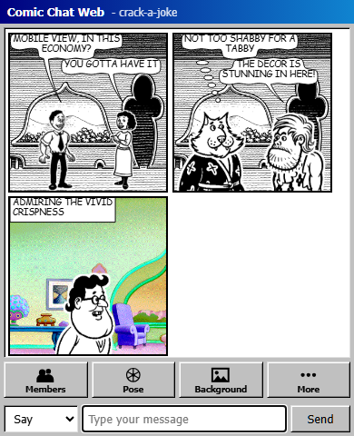

<h1>
  
  Comic Chat Web
</h1>

**Modern TypeScript port of the 1996+ Microsoft Comic Chat IRC client w/ Cloudflare Durable Objects as the network layer.**

<p>
  
  <a href="https://biomejs.dev"></a>
</p>

Live Demo @ [comics.remsky.art](https://comics.remsky.art/)

## Features

The composition rules follow the SIGGRAPH '96 [Comic Chat paper](https://kurlander.net/DJ/Pubs/SIGGRAPH96.pdf) by David Kurlander, Tim Skelly, and David Salesin. 

Validated against traces from an instrumented C++ client of the original to accurately reproduce the original engine including:

- 31-character cast, automatic panel layout
- Emotion detection, speech balloon splines
- Avatar posing, reactive angles and camera

<details>
<summary>Modern tweaks and commands</summary>


### Slash Commands/Gestures:

Typing `/` will list gestures the character you are wearing has art for: most carry three or four, some none. The command text itself is stripped from messages. `/wave Heya` becomes `Heya` with the body swapped in. 

```markdown
`/wave` `/shrug`, `/point` `/pointself` `/doublepoint`, `/walk` `/walkup` `/walkaway`
```

Gesture commands reach pose art found in the files that did not otherwise seem accessible. The original stores these under codes above the emotion ring and looks skipped by `GetBodyFromEmotion`; an `#if 0` around `CheckStarts` in `textpose.cpp` also seems to stop any typed text from reaching them either, but have enabled them here


### Defaults

These are by default and control some quality-of-life changes not in the 1996 client. Turn it off to get closer to the original behavior.

| Tweak | On | Off |
| --- | --- | --- |
| Balloon text | Smaller unit, more text per panel | 1996 metrics |
| Cast | Two people on one character share a panel | Same character always splits into separate panels |
| Background picker | Thumbnail grid | Dropdown |
| `@nick` | Opens a menu of who is here; picking one inserts the plain nick | Literal text |
| `/gesture` | Poses the avatar | Literal text |

Naming someone points your avatar at them, and being named highlights that line and adds an `*` to the tab title. Both work off the bare name, with or without the `@`. Anyone can wear any character, so some composition rules were adjusted to key by nickname and avatar. Optional nametags can be enabled if it feels confusing. 


</details>

## Deployment / Self-Hosting

> [!NOTE]
> Rooms are anonymous (no accounts); moderation is rudimentary: a content filter with escalating mutes. 
> 
> Deploy usage defaults are intentionally bounded by the fixed room list, but can be extended to create-on-join. If deploying publically; add Cloudflare rate-limiting rules (demo settings described below).

  <a href="https://deploy.workers.cloudflare.com/?url=https://github.com/remsky/comic-chat-web"></a>


<details>
<summary>Deployment Details</summary>

- For Cloudflare Workers Builds, use `npm run build` as the build command and `npx wrangler deploy` as the deploy command.

Suggested settings (set as defaults), and best-effort config against roving bots, bad actors, connection disruptions are described below:

- Live rooms operate over Cloudflare Durable Object WebSockets
    - Bounded, chunked message history with per-socket abuse limit
    -   New joins receive the latest 50 messages and load older history in 50-message chunks. 
    -   Each room retains up to 500 messages, dropping earliest history after that point. 
- Each room caps active sockets (12) and per-socket send rate.
- One chat message in flight at a time per client: a next send requires the server's echo to return. 
- Liveness failure greys the composer and reconnects; the unechoed message recovers to the send box.
- Only the rooms in the `ROOMS` var (`wrangler.jsonc`, or the dashboard) accept connections, bounding how many Durable Objects a public deploy can create.
- For a public deployment, add a Cloudflare rate-limiting rule on `/api/*` and a usage notification: worker invocations could scale with heavy automated abuse.

</details>

## Technical

<details open>
<summary>Local Run</summary>

Spin up locally to test via:

```sh
git clone https://github.com/remsky/comic-chat-web
cd comic-chat-web
npm install
npm run preview:worker
```

</details>


<details>
<summary>Testing</summary>

```sh
npm ci
npm run dev          # Vite dev server at localhost:5173
npm test             # both vitest projects: node + worker
npm run test:browser # Playwright desktop + mobile smoke
npm run check        # biome + strict tsc over src, worker, test, and tools
```

`npm test` runs two vitest projects, selectable with `--project`:

| Project | Runs in | Covers |
| --- | --- | --- |
| `node` (`test/`) | node | Engine units and golden trace suites |
| `worker` (`test/worker/`) | workerd, via `@cloudflare/vitest-pool-workers` | Durable Object behavior against real SQL storage and the live WebSocket protocol |

Worker tests get isolated storage per test and read their bindings from `wrangler.jsonc`. They typecheck under their own `test/worker/tsconfig.json`, since workers types collide with the node and DOM types the rest of the suite uses.

</details>

<details>
<summary>Trace validation</summary>

The engine is validated against JSONL traces from an instrumented C++ client, the [Comic Chat trace harness](https://github.com/remsky/comic-chat/tree/trace-harness):

| Trace | Validation focus |
| --- | --- |
| `smoke-01` | Core two-speaker flow, balloon modes, emotions, and panel breaks |
| `balloon-01` | Interleaved say, think, whisper, and shout balloon geometry |
| `edge-01` | Single-character, punctuation-only, and repeated messages |
| `emotion-01` | Shouting, laughter, greetings, smileys, pointing, and waving rules |
| `long-01` | Multi-panel overflow, retries, continuation, and three-speaker ordering |
| `speakers-01` | Six-speaker avatar selection, placement, flipping, and ordering |
| `wrap-01` | Long text, wrap boundaries, URLs, and unbreakable words |

</details>

<details>
<summary>Art pipeline</summary>

All steps are deterministic and byte-reproducible, sourced from a sibling checkout of the [Comic Chat trace harness](https://github.com/remsky/comic-chat/tree/trace-harness):

- `npm run assets:avatars`: packed per-character avatar atlases and runtime manifest in `public/assets/avatars/` from the original `.avb` files.
- `npm run assets:backgrounds`: backdrop PNGs in `public/assets/backgrounds/` from the original `.bgb` files.
- `npm run fixtures:avatars`: the test fixture.

</details>


<details open>
<summary>Screenshots</summary>

<table>
  <tr>
    <td width="41%"></td>
    <td width="21.5%"></td>
    <td width="29.5%"></td>
  </tr>
</table>
</details>


## Related projects to check out

- [TimBroddin/comic-chat-macos](https://github.com/TimBroddin/comic-chat-macos): a macOS port of Comic Chat ([write-up](https://broddin.be/bringing-microsoft-comic-chat-to-the-mac-using-fable/))
- [theAlexes/comic-chat-deslopped](https://github.com/theAlexes/comic-chat-deslopped): fork of the official Microsoft source sans AI cruft; with Windows build fixes
- [comicchat/comicchat](https://github.com/comicchat/comicchat): unofficial TypeScript port from the official source; connects to IRC servers over WebSockets, no backend
- [codegod100/comic-chat](https://github.com/codegod100/comic-chat): fork of the official Microsoft source starting a Qt6 desktop port
- [gyng/comicchat](https://github.com/gyng/comicchat) (archived): quick and dirty web client and node.js server based on Comic Chat

## License and attributions

Except for the third-party material identified below, this project is licensed under the [GNU Affero General Public License v3.0 only](LICENSE). If you operate a modified version over a network, the AGPL requires you to offer its corresponding source to the people using it.

Microsoft-derived code and artwork retain Microsoft's MIT license and notice. See [Third-Party Notices](THIRD_PARTY_NOTICES.md) and the preserved [Microsoft MIT license](LICENSES/MIT-Microsoft.txt) for details.

This is an unofficial community project and is not affiliated with or endorsed by Microsoft; based on the [open-source Microsoft Comic Chat repository](https://github.com/microsoft/comic-chat).
