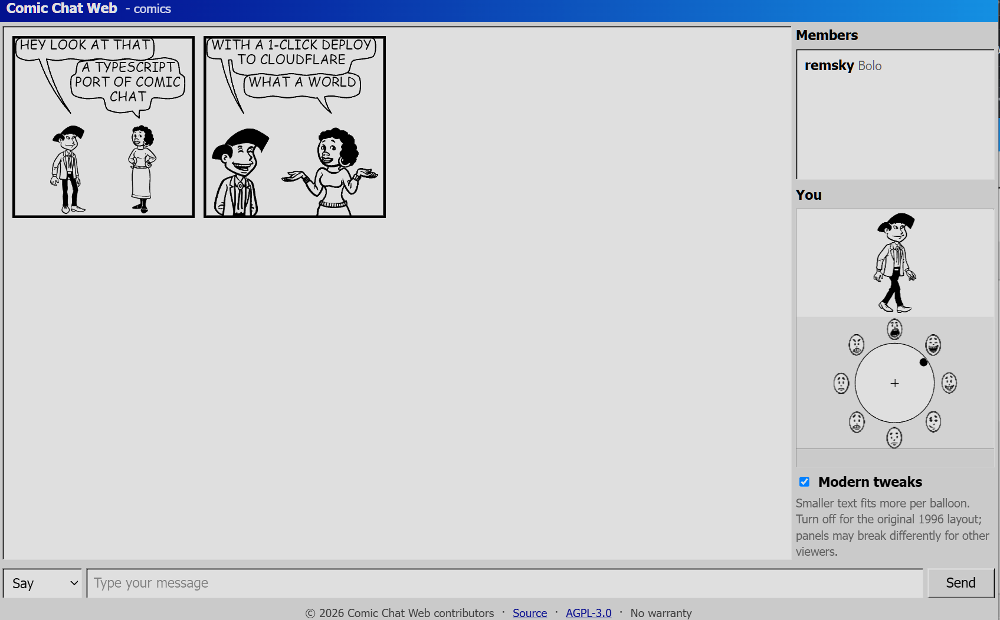
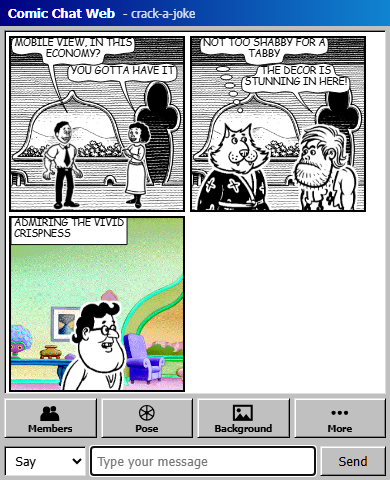
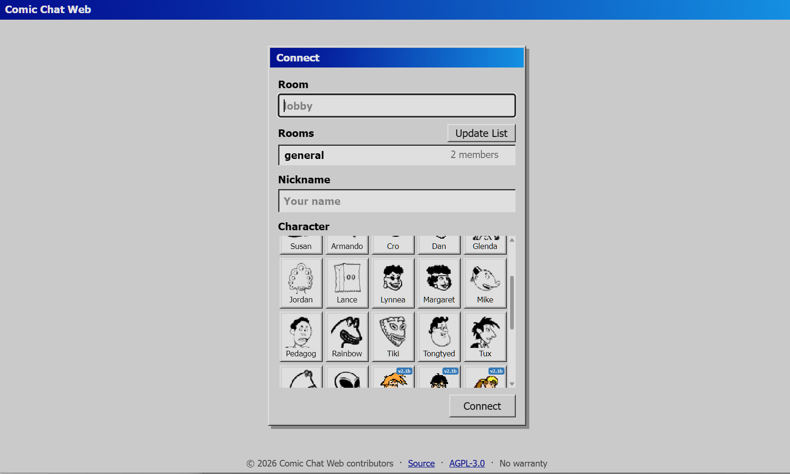
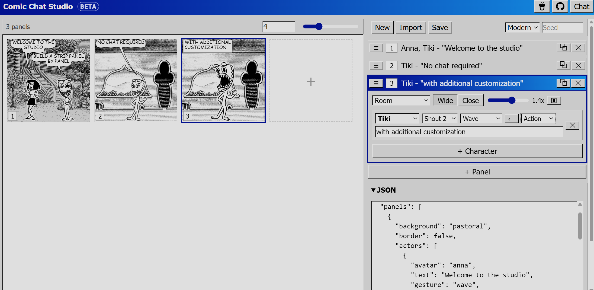
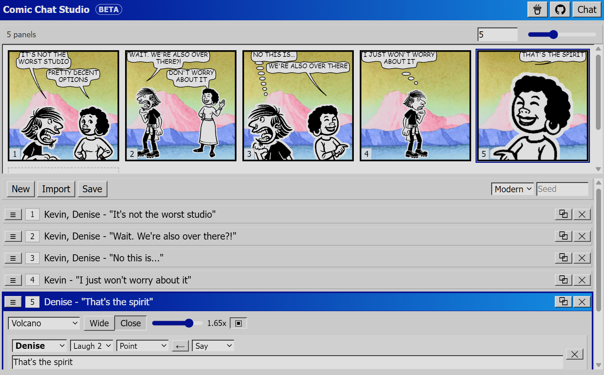
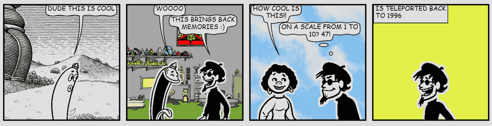
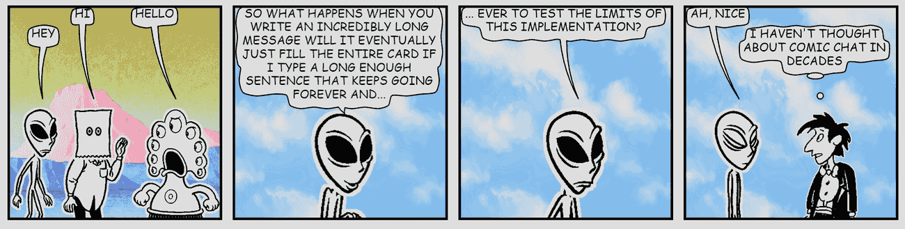
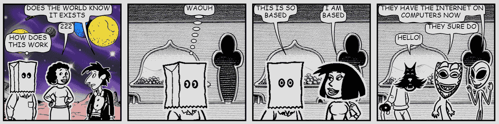

<h1>
  
  Comic Chat Web
</h1>

**Modern TypeScript port of the 1996+ Microsoft Comic Chat IRC client w/ Cloudflare Durable Objects as the network layer.**

<p>
  
  <a href="https://biomejs.dev"></a>
</p>

### Live Demo @ [comics.remsky.art](https://comics.remsky.art/)

### Create a custom comic strip @ [comics.remsky.art/studio](https://comics.remsky.art/studio)

<hr>

To create with AI assistance, see [Studio](#studio) section or add skill via:

```bash
npx skills add remsky/comic-chat-web 
```

## Features

The composition rules follow the SIGGRAPH '96 [Comic Chat paper](https://kurlander.net/DJ/Pubs/SIGGRAPH96.pdf) and original works: ([credits](#license-and-attributions)). 

Validated against traces from an instrumented C++ client of the original to accurately reproduce the original engine including:

- Original character cast and artpacks, automatic panel layout
- Emotion detection, speech balloon splines
- Avatar posing, reactive angles and camera

<details open>
<summary>Screenshots</summary>

<table>
  <tr>
    <td width="41%"></td>
    <td width="21.5%"></td>
    <td width="29.5%"></td>
  </tr>
</table>
</details>

<details>
<summary>Modern tweaks and commands</summary>


### Slash Commands/Gestures:

Typing `/` will list gestures the character you are wearing has art for: most carry three or four, some none. 

The command text itself is stripped from messages. Gesture commands reach pose art found in the files that did not otherwise seem accessible. The original stores these under codes above the emotion ring which appears skipped by `GetBodyFromEmotion`. 

```markdown
/wave /shrug 
/point /pointself /doublepoint
/walk /walkup /walkaway
```

### Defaults

These are by default and control some quality-of-life changes not in the 1996 client. Turn it off to get closer to the original behavior.

| Tweak | On | Off |
| --- | --- | --- |
| Balloon text | Smaller unit, more text per panel | 1996 metrics |
| Cast | Two people on one character share a panel | Same character always splits into separate panels |
| Background picker | Thumbnail grid | Dropdown |
| `@nick` | Opens a menu of who is here; picking one inserts the plain nick | Literal text |
| `/gesture` | Poses the avatar | Literal text |

Naming someone points your avatar at them, and being named highlights that line and adds an `*` to the tab title. Both work off the bare name, with or without the `@`. Anyone can wear any character, so some composition rules were adjusted to key by nickname and avatar. Optional nametags can be enabled if it feels confusing. 

</details>

## Studio

An integrated editor allowing you to create strips (panel by panel) on your own is available at [/studio](https://comics.remsky.art/studio)

The result is exportable as a PNG sheet or square, as an MP4 or GIF that plays the panels in order, or import/export as its JSON definition document. It's pretty fun to tool around with. 

- Available art per character is generated as an asset list in `catalog.json`.
- Includes art, combinations, and control not reachable in normal chat (sizing, direction, gestures, etc).
- The `MODERATION` variable acts similarly to how it does in chat, putting a pause on rendering. See [DEPLOYMENT.md](DEPLOYMENT.md).

For assistance from an AI agent to spin up some strips, a skill is available. It has understanding of the poses, backgrounds, characters, limitations, and can generate a condensed link that will prefill the editor page for review/adjustments/download. See [/agent-skill](https://comics.remsky.art/agent-skill) for details or use one of the following methods:

<details>
<summary>npx skills</summary>

```bash
npx skills add remsky/comic-chat-web 
```
</details>

<details>
<summary>zipped .skill file</summary>

Download [comic-strip.skill](https://github.com/remsky/comic-chat-web/releases/latest/download/comic-strip.skill) from the [latest release](https://github.com/remsky/comic-chat-web/releases/latest) and drop it into a chat on ChatGPT or claude.ai as a custom skill.
</details>

<details>
<summary>Claude Code Plugin</summary>

```bash
/plugin marketplace add remsky/comic-chat-web
/plugin install comic-strip@comic-chat-web
```
</details>

<details>
<summary>OpenAI Codex Plugin</summary>

```bash
codex plugin marketplace add remsky/comic-chat-web
codex plugin add comic-strip@comic-chat-web
```

</details>
<br>
<details open>
<summary>Screenshots</summary>

<table>
  <tr>
    <td width="35%"></td>
    <td width="65%"></td>
  </tr>
</table>
</details>

<details>
<summary>Sample JSON</summary>

```json
{
  "version": 2,
  "columns": 5,
  "panels": [
    {
      "background": "volcano",
      "camera": "close",
      "actors": [
        {
          "avatar": "kevin",
          "text": "It's not the worst studio",
          "emotion": "shout"
        },
        {
          "avatar": "denise",
          "text": "Pretty decent options",
          "facing": "left"
        }
      ]
    },
    {
      "background": "volcano",
      "zoom": 1.3,
      "actors": [
        {
          "avatar": "kevin",
          "text": "Wait. We're also over there?!",
          "emotion": "shout",
          "gesture": "pointself",
          "facing": "left"
        },
        {
          "avatar": "denise",
          "text": "Don't worry about it",
          "emotion": "laugh_1",
          "gesture": "wave",
          "facing": "left"
        }
      ]
    }
  ]
}

```


</details>

## Deployment / Self-Hosting

> [!NOTE]
> Rooms are anonymous (no accounts); moderation is rudimentary: a content filter with escalating mutes. A deploy is bounded by its fixed room list, and public billed deployments must determine and set Cloudflare rate-limiting rules and usage alerts to avoid any suprising bills. On Free Tier, it will simply stop running until end of day if limits are reached. For reference, the traffic on this repo's demo sits comfortably under 10% of daily Free Tier usage. 

  <a href="https://deploy.workers.cloudflare.com/?url=https://github.com/remsky/comic-chat-web"></a>


See [DEPLOYMENT.md](DEPLOYMENT.md) before deploying to understand the parameters available: `ROOMS` and `MODERATION` vars, the source constants behind the rate limits and retention, the build variables that name an operator on the terms page, and what a fork inherits.

## Reception

Sampled from the live rooms as rendered; without attributions

<details open>
<summary>Screenshots</summary>

<table align="center" width="72%">
  <tr>
    <td></td>
  </tr>
  <tr>
    <td></td>
  </tr>
  <tr>
    <td></td>
  </tr>
</table>

</details>

## Technical

<details open>
<summary>Local Run</summary>

Spin up locally to test via:

```sh
git clone https://github.com/remsky/comic-chat-web
cd comic-chat-web
npm install
npm run preview:worker
```

</details>


<details>
<summary>Testing</summary>

```sh
npm ci
npm run dev          # Vite dev server at localhost:5173
npm test             # both vitest projects: node + worker
npm run test:browser # Playwright desktop + mobile smoke; wants `npm run dev:api` up for the studio's screen call
npm run check        # biome + strict tsc over src, worker, test, and tools
```

`npm test` runs two vitest projects, selectable with `--project`:

| Project | Runs in | Covers |
| --- | --- | --- |
| `node` (`test/`) | node | Engine units and golden trace suites |
| `worker` (`test/worker/`) | workerd, via `@cloudflare/vitest-pool-workers` | Durable Object behavior against real SQL storage and the live WebSocket protocol |

Worker tests get isolated storage per test and read their bindings from `wrangler.jsonc`. They typecheck under their own `test/worker/tsconfig.json`, since workers types collide with the node and DOM types the rest of the suite uses.

</details>

<details>
<summary>Trace validation</summary>

The engine is validated against JSONL traces from an instrumented C++ client, the [Comic Chat trace harness](https://github.com/remsky/comic-chat/tree/trace-harness):

| Trace | Validation focus |
| --- | --- |
| `smoke-01` | Core two-speaker flow, balloon modes, emotions, and panel breaks |
| `balloon-01` | Interleaved say, think, whisper, and shout balloon geometry |
| `edge-01` | Single-character, punctuation-only, and repeated messages |
| `emotion-01` | Shouting, laughter, greetings, smileys, pointing, and waving rules |
| `long-01` | Multi-panel overflow, retries, continuation, and three-speaker ordering |
| `speakers-01` | Six-speaker avatar selection, placement, flipping, and ordering |
| `wrap-01` | Long text, wrap boundaries, URLs, and unbreakable words |

</details>

<details>
<summary>Art pipeline</summary>

All steps are deterministic and byte-reproducible, sourced from a sibling checkout of the [Comic Chat trace harness](https://github.com/remsky/comic-chat/tree/trace-harness):

- `npm run assets:avatars`: packed per-character avatar atlases and runtime manifest in `public/assets/avatars/` from the original `.avb` files.
- `npm run assets:backgrounds`: backdrop PNGs in `public/assets/backgrounds/` from the original `.bgb` files.
- `npm run fixtures:avatars`: the test fixture.

</details>


## Related projects to check out

- [TimBroddin/comic-chat-macos](https://github.com/TimBroddin/comic-chat-macos): a macOS port of Comic Chat ([write-up](https://broddin.be/bringing-microsoft-comic-chat-to-the-mac-using-fable/))
- [theAlexes/comic-chat-deslopped](https://github.com/theAlexes/comic-chat-deslopped): fork of the official Microsoft source sans AI cruft; with Windows build fixes
- [comicchat/comicchat](https://github.com/comicchat/comicchat): unofficial TypeScript port from the official source; connects to IRC servers over WebSockets, no backend
- [codegod100/comic-chat](https://github.com/codegod100/comic-chat): fork of the official Microsoft source starting a Qt6 desktop port
- [gyng/comicchat](https://github.com/gyng/comicchat) (archived): quick and dirty web client and node.js server based on Comic Chat

## License and attributions

This unofficial port builds on the original Microsoft Comic Chat client and the efforts of those who preserved it.

- **Jim Woodring**: created the original character cast, poses, and backgrounds
- **Vincent Connare**: designed Comic Sans, the typography of Comic Chat's speech balloons
- **David Kurlander**: original creator and lead developer of the Microsoft Comic Chat engine (1995)
- **Tim Skelly and David Salesin**: co-authors, with Kurlander, of the SIGGRAPH '96 [Comic Chat paper](https://kurlander.net/DJ/Pubs/SIGGRAPH96.pdf) defining the panel layout, balloon placement, and avatar composition algorithms reproduced in this port
- **Robert Standefer and Scott Hanselman**: facilitated the 2026 open-source release of the original Microsoft repository

Except for the third-party material identified below, this project is licensed under the [GNU Affero General Public License v3.0 only](LICENSE). If you operate a modified version over a network, the AGPL requires you to offer its corresponding source to the people using it.

Microsoft-derived code and artwork retain Microsoft's MIT license and notice. See [Third-Party Notices](THIRD_PARTY_NOTICES.md) and the preserved [Microsoft MIT license](LICENSES/MIT-Microsoft.txt) for details.

This is an unofficial community project and is not affiliated with or endorsed by Microsoft; based on the [open-source Microsoft Comic Chat repository](https://github.com/microsoft/comic-chat).
